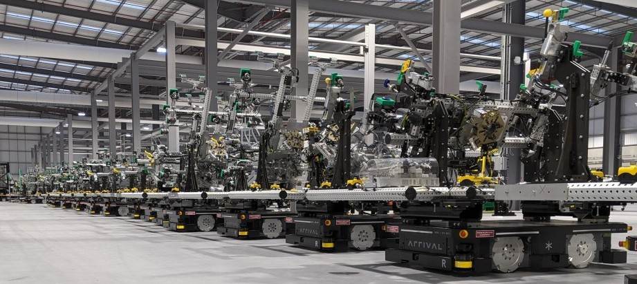

# A scalable architecture for systems of systems

I conceived the software architecture for Arrival's industrial mobile robot fleet, a distributed system of hundreds of robotic agents working as one to deliver a vision of flexible (software-defined) manufacturing. Here's how I built the system up in complexity and scale incrementally.

## Motivation

 
**The micro-factory concept** (video)

 
**Factory operations** (video)
(Notice the AMR _clusters_ working as one to transport oversized payloads)

 
**WeMo fleet**

## Complexity

We were always in production mode. Functionality were constantly added/removed/changed on a biweekly [rolling release cadence](../process/release_cadence.md) on AMRs serving in production environment!

A sample sequence of such changes:

- Inside robot
  - Initial hardware platform consisting of a drive system and lidars (non-safety rated)
  - Coupling system added (PoC) and removed
  - Upgraded to a new drive system (motor controllers), safety lidars (safety), and compute SoC
  - BMS added
  - Cameras x4 added
  - Precise positioning system added
  - Power Delivery Board (PDB) added (multiple HW & FW revisions)
  - Charging system added
  - Operating System changed (Ubuntu 18 to Ubuntu 22)
  - WiFi HW changed (802.11ac to 802.11ax)
  - Short stroke lift system added
  - Traction motors changed (different windings => different control gains)
  - Drive system firmware changed (multiple revisions)
  - HMI added
  - Second safety comms link added
  - Onboard VSLAM added
- Outside robot
  - Mixed fleet: 7x EP3, 80x EP5 (added gradually over two years) (not all EP5’s were the same!)
  - Fleet manager, a Raspberry Pi4, running following services: route planner, entity tracker, junction traffic controller, health monitor
  - Factory control system (constantly updated with breaking API changes)
  - Dashboards (multiple) to view system status
  - Multiple operator consoles (laptops) running different versions of the software

One software stack, maintained as a mono-repo, supported every variant in production! We did not have different branches for different hardware and software releases.

How did we do it? With the following design principles

- Layered Databus Architecture
- Design for modularity
- Design for observability
- Design for introspection and dynamic reconfiguration

## Layered Databus Architecture: Concept

[Read the technical note](../process/lda.md)

## Layered Databus Architecture: Manifestation

## Layered Databus Architecture: Coupling

- Use tight coupling
  - Within a process
  - In performance sensitive sub-systems
- Use loose coupling
  - Between sub-systems implemented as independent processes

## Design for Modularity

- Modularity allows:
  - Dynamic reconfigurability (Exchange tools, Exchange manipulators)
  - Flexibility (adapt to changes, without massive redesign)
  - Composability (robot = mobility platform + manipulator + tool)
- Modularity requires well defined interfaces
  - Mechanical (eg: couplers)
  - Electrical (eg: power, estops), data buses (eg: ethernet)
  - Software: Data structures, APIs
- Modularity is enhanced by loose coupling
  - Auto discover and (re)configure
  - Connectionless: data-centric, not transactional (no client-server)
  - No master-slave relationship, no ownership (MM does not own OM)
- Modularity has a cost: Every module must be self-sufficient - requires own power, compute, interfaces

## Design for observability

- System state must be observable from power-up
  - Impossible to ‘reason’ about system behaviour without it
  - Don’t: Initialise state from persistent memory (i.e. ‘state’ captured at previous shutdown). This is brittle, especially higher up the software stack.
  - Ensure system always fails into a safe state
- May impose additional sensing requirements
  - Example 1: Charging system: 
    - Microswitches to sense whether charging contacts are retracted or deployed
  - Example 2: Motion system
    - Absolute encoders (not incremental), if initialisation ‘dance’ is undesirable
    - Limit switches at end-stops (if incremental encoders), readable from software
  - Example 3: HW power off
    - Signal high-level SW to shutdown cleanly (sync to disk etc)
    - Wait on SW to respond before cutting power
- Do: Develop emulator for intended function/behaviour in software 
  - Clarifies requirements on mechanical and electronics design
  - Enables software team to make progress without hardware available from day 1
  - Enables validation of real hardware, when it becomes available

## Design for introspection and dynamic (re)configuration

- Version control everything (software, hardware, firmware)
  - Two slightly different manipulator designs using the exact same electronics is still a different piece of hardware from the software point of view
- Define a protocol to query devices for identification
  - Example (low level): CANOpen SDO for device name, hardware version, software version
  - Example (high level): Application to report software version 
- Announce function availability/removal/dropout
  - Example (low level): CANOpen node guarding
  - Example (high level): DDS discovery (Zenoh ‘liveliness’) callbacks  
- Make over-the-air update possible
  - Single step deploy: Allow CI to push artifacts to HW over the network. 

## Design example: Hot-swappable tool

- Initial design (*codesign*: mechanical + electronics + software)
  - Agree on behaviour, especially on attachment/removal
  - Design the protocol
    - Queryable hardware ID/revision and firmware version
    - Define commands and responses (data format)
    - Status and failure reporting method
    - Strategy to fail safely.
  - Resolve sensing requirements
- Software implementation
  - Implement ‘driver’ interface
  - Implement emulator, mimic behaviour to acceptable fidelity (usually full dynamics/physics not required)
  - Implement Unit Tests for the interface against the emulator
- Hardware implementation
  - Independent compute (could be uC) to handle protocol
  - Validate hardware behaviour against emulator (Essentially run the same unit tests, but with hardware-in-the-loop instead of emulator)

## Conclusions

- During design stage, get hardware and software engineers to agree on communication protocols and subsystem behaviour
- Without observability, one cannot ‘reason’ about the state of the system in software. Don't skimp on sensors to observe state. Cost-cut elsewhere.
- Without introspectability, one cannot dynamically reconfigure systems of the kind we want to build. Design subcomponents such that their capabilities can be queried. 
- Exploit modularity to incrementally build complex systems by composition over time. 
- Production mindset from day 1. Follow the above to keep making progress despite
  - Procurement and supply-chain delays
  - Hardware idiosyncrasies taking longer than expected to understand
  - System complexity growing unbounded over time
